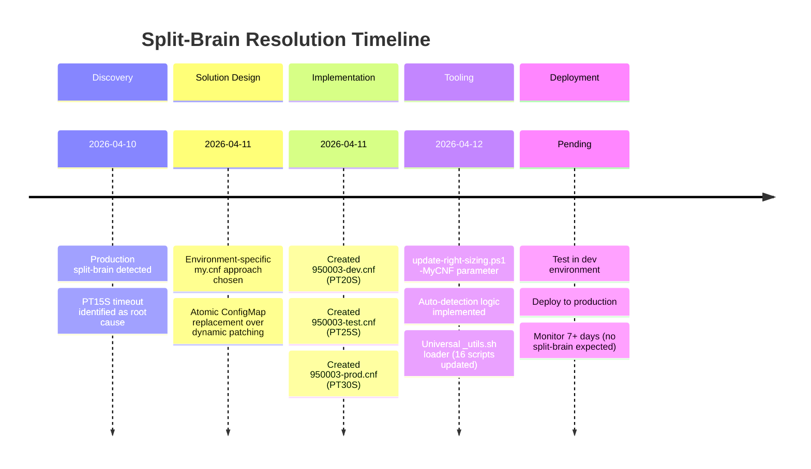

# Galera Split-Brain Resolution

Complete documentation for preventing, diagnosing, and recovering from MariaDB Galera split-brain scenarios in OpenShift.

---

## 🚨 Quick Start

**Production is down with split-brain?**

1. **[PRODUCTION-SPLIT-BRAIN-RESOLUTION.md](PRODUCTION-SPLIT-BRAIN-RESOLUTION.md)** - Executive summary + immediate action plan
2. **[galera-timeout-quickstart.md](galera-timeout-quickstart.md)** - Deploy PT30S fix in 10 minutes

---

## 📚 Documentation Index

### Root Cause & Resolution
- **[galera-split-brain-rca.md](galera-split-brain-rca.md)** - Root cause analysis (PT15S timeouts in OpenShift SDN)
- **[PRODUCTION-SPLIT-BRAIN-RESOLUTION.md](PRODUCTION-SPLIT-BRAIN-RESOLUTION.md)** - Executive summary + rollout plan

### Implementation Guides
- **[galera-timeout-quickstart.md](galera-timeout-quickstart.md)** - Deploy timeout fix (10 min guide)
- **[galera-timeout-tuning-strategy.md](galera-timeout-tuning-strategy.md)** - Environment-specific tuning strategy
- **[galera-timeout-in-cluster-architecture.md](galera-timeout-in-cluster-architecture.md)** - In-cluster automation architecture

### Reference Documentation
- **[galera-timeout-reference.md](galera-timeout-reference.md)** - Complete timeout parameter reference
- **[galera-testing-strategy.md](galera-testing-strategy.md)** - Five-tier testing approach
- **[production-split-brain-testing-strategy.md](production-split-brain-testing-strategy.md)** - Production testing procedures

---

## 🎯 Problem Summary

**Root Cause:** Bitnami MariaDB Galera defaults to `evs.inactive_timeout=PT15S` (15 seconds), which is too aggressive for OpenShift's SDN overlay network. Transient network latency causes false-positive node evictions, leading to split-brain.

**Solution:** Increase timeout to PT30S for production (5-replica clusters) via environment-specific my.cnf files uploaded to ConfigMap.

**Status:** ✅ Solution implemented, tooling complete, ready for production deployment

---

## 📈 Timeline



---

## 🔧 Tools

### PowerShell (Local)
```powershell
# Upload PT30S configuration to production
.\scripts\update-right-sizing.ps1 -Namespace 950003-prod

# Test custom timeout variation
.\scripts\update-right-sizing.ps1 -Namespace 950003-dev -MyCNF config\mariadb\my-test-PT35S.cnf

# Verify timeout configuration
.\scripts\check-galera-timeout-config.ps1 -Namespace 950003-prod

# Measure network latency
.\scripts\measure-galera-network-latency.ps1 -Namespace 950003-prod
```

### Bash (In-Cluster)
```bash
# Inspect cluster health
oc exec deployment/pod-health-monitor -n 950003-prod -- bash /scripts/galera-inspect.sh

# Verify timeout applied
oc exec mariadb-galera-0 -n 950003-prod -- \
  mysql -e "SHOW VARIABLES LIKE 'wsrep_provider_options';" | grep inactive_timeout
```

---

## 📊 Environment-Specific Configs

| Environment | File | Timeout | Replicas | Status |
|------------|------|---------|----------|--------|
| **Development** | [config/mariadb/950003-dev.cnf](../../../config/mariadb/950003-dev.cnf) | PT20S | 2 | ✅ Created |
| **Test** | [config/mariadb/950003-test.cnf](../../../config/mariadb/950003-test.cnf) | PT25S | 3 | ✅ Created |
| **Production** | [config/mariadb/950003-prod.cnf](../../../config/mariadb/950003-prod.cnf) | PT30S | 5 | ✅ Created |

---

## 🧪 Testing Strategy

**Five-Tier Approach:**

1. **Tier 1:** Local validation (syntax, wsrep_provider_options parsing)
2. **Tier 2:** Dev deployment (2-replica, PT20S)
3. **Tier 3:** Test deployment (3-replica, PT25S)
4. **Tier 4:** Production deployment (5-replica, PT30S)
5. **Tier 5:** Long-term monitoring (7+ days, no split-brain)

See [galera-testing-strategy.md](galera-testing-strategy.md) for details.

---

## 🔗 Related Documentation

### Parent Documentation
- **[../README.md](../README.md)** - Developer tools overview
- **[../../galera-monitoring-solution.md](../../galera-monitoring-solution.md)** - Pod health monitor architecture
- **[../../manual-galera-troubleshooting.md](../../manual-galera-troubleshooting.md)** - Manual recovery procedures

### Configuration
- **[../right-sizing-galera-integration.md](../right-sizing-galera-integration.md)** - Unified resource + database management
- **[../pod-health-monitor-utilities.md](../pod-health-monitor-utilities.md)** - In-cluster utility management

---

## ⚠️ Important Notes

1. **Production is still vulnerable** until PT30S configuration is deployed
2. **Test in dev first** to validate complete workflow
3. **Monitor logs during pod restart** to catch any issues
4. **Verify timeout applied** with MySQL query after deployment
5. **Watch for 7+ days** to confirm split-brain is resolved

---

## 🎓 Learning Resources

- [Galera Cluster Parameters](https://galeracluster.com/library/documentation/galera-parameters.html)
- [MariaDB Galera System Variables](https://mariadb.com/kb/en/galera-cluster-system-variables/)
- [OpenShift SDN Networking](https://docs.openshift.com/container-platform/4.12/networking/understanding-networking.html)
