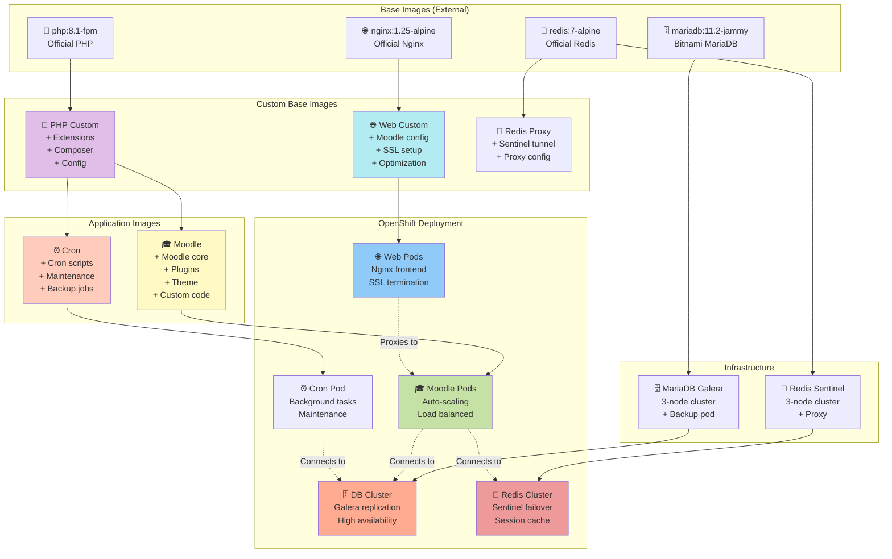
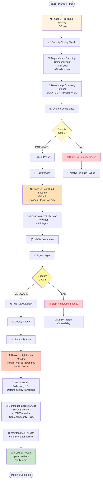
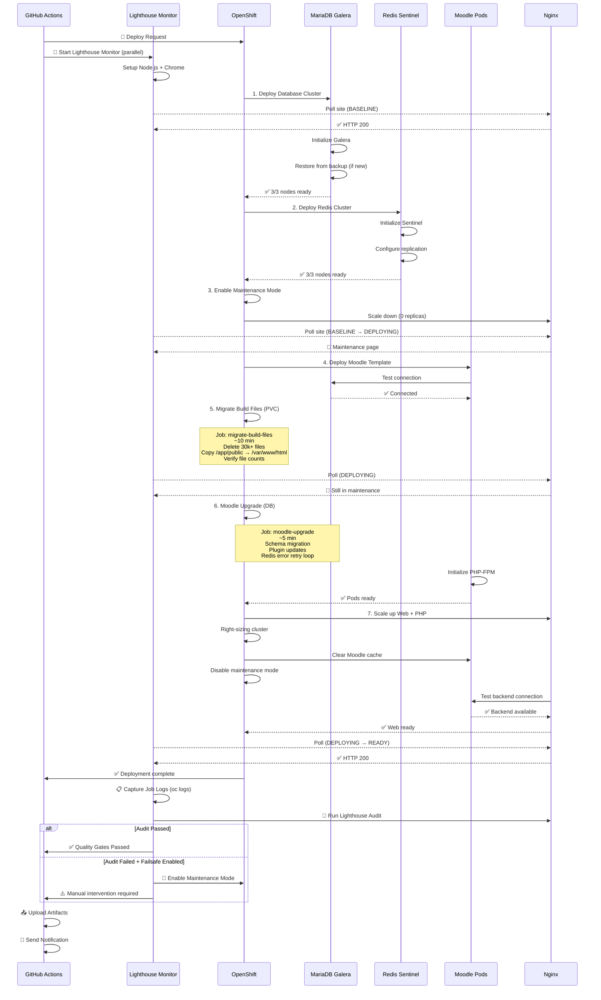
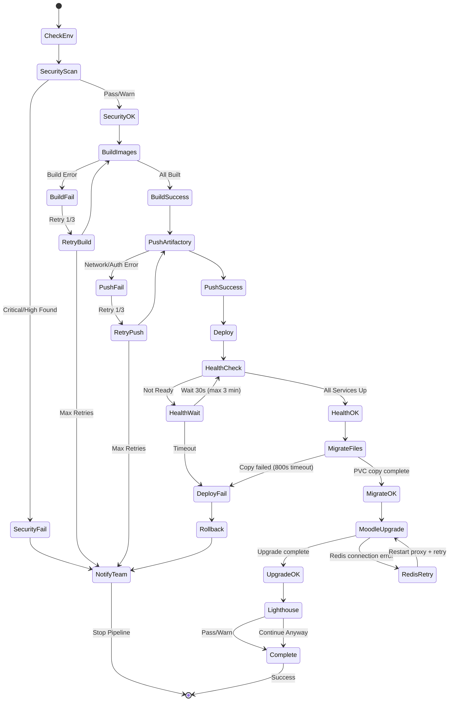

# 🚀 Build & Deployment Workflow

## Complete CI/CD Pipeline Architecture

```mermaid
graph TD
    Start([🎯 GitHub Push/Schedule]) --> Trigger{Event Type?}

    Trigger -->|Push to Branch| Branch[📌 Branch Detection<br/>dev/test/prod]
    Trigger -->|Schedule| Schedule[⏰ Cron: Saturday 3AM]

    Branch --> CheckEnv
    Schedule --> CheckEnv

    CheckEnv[📋 Environment Check<br/>~30 seconds]

    CheckEnv --> LoadConfig[🔧 Load Configuration<br/>- example.env<br/>- example.versions.env<br/>- Security settings]

    LoadConfig --> Security{Security<br/>Scan?}

    Security -->|ENABLED=YES| SecScan[🔒 Security Validation<br/>~2-8 min<br/>See security-scanning-flow.md]
    Security -->|ENABLED=NO| SkipSec[⏭️ Skip Security]

    SecScan --> SecResult{Exit<br/>Strategy}

    SecResult -->|WARN| Proceed[✅ Continue Build]
    SecResult -->|CRITICAL/HIGH| SecCheck{Critical/High<br/>Found?}

    SecCheck -->|YES| SecFail[❌ FAIL BUILD<br/>Security Gate Failed]
    SecCheck -->|NO| Proceed

    SkipSec --> Proceed

    SecFail --> NotifySec[🔔 Notify Team<br/>Rocket.Chat]

    Proceed --> SkipBuild{SKIP_BUILDS<br/>= YES?}

    SkipBuild -->|YES| SkipToDeploy[⏭️ Skip to Deploy]
    SkipBuild -->|NO| BuildPhase[🔨 BUILD PHASE]

    BuildPhase --> Parallel{Parallel<br/>Builds}

    Parallel --> PHP[🐘 PHP Image<br/>~3-5 min<br/>- PHP 8.1-fpm<br/>- Extensions<br/>- Composer deps]
    Parallel --> Web[🌐 Web Image<br/>~2-3 min<br/>- Nginx 1.25<br/>- Config files<br/>- SSL setup]
    Parallel --> Helm[📦 Helm Charts<br/>~1-2 min<br/>- MariaDB Galera<br/>- Redis Cluster<br/>- Dependencies]
    Parallel --> Redis[🔴 Redis Proxy<br/>~2-3 min<br/>- Sentinel tunnel<br/>- Proxy config]

    PHP --> PHPDone[✅ PHP Built]
    Web --> WebDone[✅ Web Built]
    Helm --> HelmDone[✅ Helm Ready]
    Redis --> RedisDone[✅ Redis Ready]

    PHPDone --> Dependent{Dependent<br/>Builds}

    Dependent --> Moodle[🎓 Moodle Image<br/>~5-8 min<br/>- Clone Moodle core<br/>- Install plugins<br/>- Theme setup<br/>- Database migration]
    Dependent --> Cron[⏰ Cron Image<br/>~3-4 min<br/>- Based on PHP<br/>- Cron scripts<br/>- Maintenance tasks]

    Moodle --> MoodleDone[✅ Moodle Built]
    Cron --> CronDone[✅ Cron Built]

    WebDone --> AllBuilt
    HelmDone --> AllBuilt
    RedisDone --> AllBuilt
    MoodleDone --> AllBuilt
    CronDone --> AllBuilt

    AllBuilt[✅ All Images Built] --> Push[📤 Push to Artifactory<br/>artifacts.developer.gov.bc.ca]

    Push --> CleanBuild{CLEAN_BUILDS<br/>= YES?}

    CleanBuild -->|YES| Cleanup[🧹 Cleanup Job<br/>~1-2 min<br/>- Delete old deployments<br/>- Keep backups<br/>- Clear resources]
    CleanBuild -->|NO| SkipClean[⏭️ Skip Cleanup]

    Cleanup --> ReadyDeploy
    SkipClean --> ReadyDeploy
    SkipToDeploy --> ReadyDeploy

    ReadyDeploy[🎯 Ready to Deploy] --> SkipDeploy{SKIP_DEPLOY<br/>= NO?}

    SkipDeploy -->|YES Deploy| DeployPhase[🚀 DEPLOYMENT PHASE]
    SkipDeploy -->|NO Skip| End

    DeployPhase --> OpenShift[☁️ OpenShift Silver Cluster<br/>~5-10 min]

    OpenShift --> Database[🗄️ Database Layer<br/>- MariaDB Galera Cluster<br/>- 3 replicas<br/>- Backup pod<br/>- Health monitoring]

    Database --> Cache[💾 Cache Layer<br/>- Redis Sentinel<br/>- 3 replicas<br/>- Failover support<br/>- Proxy tunneling]

    Cache --> App[🎓 Application Layer<br/>- Moodle pods<br/>- PHP-FPM processing<br/>- Session handling<br/>- PVC file storage]

    App --> WebTier[🌐 Web Tier<br/>- Nginx pods<br/>- SSL termination<br/>- Load balancing<br/>- Static content]

    WebTier --> Background[⏰ Background Tasks<br/>- Cron pod<br/>- Scheduled jobs<br/>- Maintenance]

    Background --> PVCMigrate{FORCE_MIGRATE<br/>= YES?}

    PVCMigrate -->|YES| RunMigrate[📂 Migrate Build Files<br/>~10 min<br/>- Copy /app/public → PVC<br/>- Delete 30k+ files<br/>- Recopy + verify<br/>- /var/www/html]
    PVCMigrate -->|NO| SkipMigrate[⏭️ Skip File Migration]

    RunMigrate --> Upgrade
    SkipMigrate --> Upgrade

    Upgrade[🔄 Moodle Upgrade<br/>~5 min<br/>- Database migration<br/>- Plugin updates<br/>- Schema changes<br/>- Redis error retry]

    Upgrade --> ScaleUp[📈 Scale Up<br/>- PHP pods<br/>- Right-sizing<br/>- Cache clear]

    ScaleUp --> DisableMaint[🔓 Disable Maintenance<br/>- Patch routes to web<br/>- Verify site health]

    DisableMaint --> DeploySuccess[✅ Deployment Successful]

    DeployFail --> NotifyFail[🔔 Failure Notification]
    NotifyFail --> End

    DeploySuccess --> Notify

    %% ── Lighthouse Monitor (runs in PARALLEL with builds/deploy) ──
    CheckEnv --> LHMonitor[🔭 LIGHTHOUSE MONITOR<br/>Parallel with builds/deploy]

    LHMonitor --> LHSetup[🏗️ LH Setup<br/>~2 min<br/>- Node.js 25 + Chrome<br/>- APT deps from cache<br/>- NPM modules from cache]

    LHSetup --> LHPoll[🔭 Site Monitoring<br/>~variable<br/>- Poll every 15s<br/>- Detect maintenance mode<br/>- Track state transitions]

    LHPoll --> LHAudit[🚦 Lighthouse Audit<br/>~5 min<br/>- Performance metrics<br/>- Accessibility checks<br/>- Security headers<br/>- SEO analysis<br/>- Best practices]

    LHAudit --> LHResult{Lighthouse<br/>Score?}

    LHResult -->|Pass| LHPass[✅ Quality Gates Passed]
    LHResult -->|Fail| LHFail{Failsafe<br/>Enabled?}

    LHFail -->|YES| MaintenanceMode[🚧 Enable Maintenance<br/>Moodle and/or OpenShift]
    LHFail -->|NO| LHWarn[⚠️ Quality Issues Detected]

    LHPass --> Artifacts
    LHWarn --> Artifacts
    MaintenanceMode --> Artifacts

    Artifacts[📤 Upload Artifacts<br/>- Security reports<br/>- Lighthouse results<br/>- Build logs<br/>- Test results]

    Artifacts --> Notify[🔔 Notification<br/>Rocket.Chat webhook<br/>- Build status<br/>- Deployment URL<br/>- Lighthouse results]

    Notify --> Complete[🎉 Pipeline Complete]

    NotifyFail --> End([🏁 Workflow End])
    Complete --> End

    style CheckEnv fill:#e3f2fd
    style SecScan fill:#fff3e0
    style SecFail fill:#ffebee,color:#c62828
    style BuildPhase fill:#e8f5e9
    style PHP fill:#f3e5f5
    style Web fill:#e0f2f1
    style Moodle fill:#fff9c4
    style Cron fill:#fce4ec
    style DeployPhase fill:#e1f5fe
    style Database fill:#f1f8e9
    style Cache fill:#fce4ec
    style App fill:#fff9c4
    style WebTier fill:#e0f2f1
    style RunMigrate fill:#fff3e0
    style Upgrade fill:#fff3e0
    style LHMonitor fill:#e8eaf6
    style LHAudit fill:#e8eaf6
    style LHPoll fill:#ede7f6
    style DeploySuccess fill:#c8e6c9
    style DeployFail fill:#ffcdd2,color:#c62828
    style Complete fill:#a5d6a7
```



---

## Environment-Specific Configuration

```mermaid
graph LR
    subgraph "🟢 Development"
        DevConfig["🔧 Configuration<br/>────────────<br/>Security: BASIC + WARN<br/>Scan Time: ~2-3 min<br/>Containers: NO<br/>────────────<br/>Builds: Usually SKIP<br/>Deploy: Fast iteration<br/>Migration: Auto<br/>────────────<br/>Monitoring: Basic"]

        DevFlow["📊 Flow<br/>────────────<br/>1. Quick security check<br/>2. Use cached images<br/>3. Deploy immediately<br/>4. Light testing<br/>────────────<br/>Total: ~5-10 min"]

        DevResult["✅ Result<br/>────────────<br/>Speed: ⚡ FAST<br/>Security: ⚠️ Core scan warn-only<br/>Preflight: may fail unresolved High/Critical<br/>────────────<br/>Best for rapid dev"]
    end

    subgraph "🟡 Test"
        TestConfig["🔧 Configuration<br/>────────────<br/>Security: FULL + HIGH<br/>Scan Time: ~6-8 min<br/>Containers: YES<br/>────────────<br/>Builds: Full rebuild<br/>Deploy: Comprehensive<br/>Migration: Validated<br/>────────────<br/>Monitoring: Enhanced"]

        TestFlow["📊 Flow<br/>────────────<br/>1. Full security scan<br/>2. Build all images<br/>3. Deploy to test env<br/>4. Full Lighthouse audit<br/>────────────<br/>Total: ~25-35 min"]

        TestResult["✅ Result<br/>────────────<br/>Speed: ⏱️ MODERATE<br/>Security: 🛡️ STRICT<br/>Testing: ✅ COMPREHENSIVE<br/>────────────<br/>Pre-prod validation"]
    end

    subgraph "🔴 Production"
        ProdConfig["🔧 Configuration<br/>────────────<br/>Security: FULL + CRITICAL<br/>Scan Time: ~6-8 min<br/>Containers: YES<br/>────────────<br/>Builds: Full rebuild<br/>Deploy: Controlled<br/>Migration: Manual trigger<br/>────────────<br/>Monitoring: Maximum"]

        ProdFlow["📊 Flow<br/>────────────<br/>1. Full security scan<br/>2. Build all images<br/>3. Health-aware deploy<br/>4. Production monitoring<br/>5. Full audit trail<br/>────────────<br/>Total: ~30-40 min"]

        ProdResult["✅ Result<br/>────────────<br/>Speed: 🐢 CAREFUL<br/>Security: 🔒 MAXIMUM<br/>Testing: 🔬 THOROUGH<br/>────────────<br/>Zero-downtime deploy"]
    end

    DevConfig --> DevFlow --> DevResult
    TestConfig --> TestFlow --> TestResult
    ProdConfig --> ProdFlow --> ProdResult

    style DevConfig fill:#c8e6c9
    style TestConfig fill:#fff9c4
    style ProdConfig fill:#ffccbc
    style DevResult fill:#a5d6a7
    style TestResult fill:#fff59d
    style ProdResult fill:#ffab91
```



---

## Build Dependencies & Timing

```mermaid
gantt
    title 🕐 Build Timeline (Full Build - Test/Prod)
    dateFormat mm:ss
    axisFormat %M:%S

    section Pre-Build
    Environment Check           :00:00, 00:30
    Security Scan (FULL)        :00:30, 08:00

    section Build Phase
    PHP Base Image              :crit, 08:30, 05:00
    Web Image (Nginx)           :08:30, 03:00
    Redis Proxy                 :08:30, 02:30
    Helm Charts                 :08:30, 01:30

    section Dependent Builds
    Moodle Image                :crit, 13:30, 08:00
    Cron Image                  :13:30, 03:30

    section Push & Cleanup
    Push to Artifactory         :21:30, 02:00
    Cleanup (if enabled)        :23:30, 01:30

    section Deployment
    Database Layer              :25:00, 03:00
    Cache Layer (Redis)         :28:00, 02:00
    Moodle Template + Pods      :crit, 30:00, 03:00
    Migrate Build Files (PVC)   :crit, 33:00, 10:00
    Moodle Upgrade (DB)         :crit, 43:00, 05:00
    Scale PHP + Right-sizing    :48:00, 02:00
    Web Tier (Nginx)            :50:00, 02:00
    Background (Cron)           :50:00, 01:30
    Cache Clear + Verification  :52:00, 01:30
    Disable Maintenance Mode    :53:30, 00:30

    section Lighthouse Monitor (Parallel)
    LH: Node.js + Chrome Setup  :08:30, 02:00
    LH: Baseline Polling        :10:30, 19:30
    LH: Deploy Monitoring       :active, 30:00, 24:00
    LH: Performance Audit       :crit, 54:00, 05:00

    section Finalize
    Upload Artifacts            :59:00, 01:00
    Send Notifications          :60:00, 00:30
```

---

## Image Build Architecture



---

## Security Integration Points



---

## Deployment Health Checks



---

## Performance Optimization Strategies

| Strategy | Dev | Test | Prod | Time Saved |
|----------|-----|------|------|------------|
| **Skip Builds** (`SKIP_BUILDS=YES`) | ✅ Common | ❌ Never | ❌ Never | ~15-20 min |
| **Cache Docker Layers** | ✅ Always | ✅ Always | ✅ Always | ~3-5 min |
| **Skip Container Scan** (`CONTAINERS=NO`) | ✅ Yes | ❌ No | ❌ No | ~4-6 min |
| **Trivy DB Cache** (`SCAN_CACHE=YES`) | ✅ Yes | ✅ Yes | ✅ Yes | ~30-60 sec |
| **Parallel Image Builds** | ✅ Yes | ✅ Yes | ✅ Yes | ~10-15 min |
| **Parallel Lighthouse Monitor** | ✅ Yes | ✅ Yes | ✅ Yes | ~8-10 min |
| **Skip Cleanup** (`CLEAN_BUILDS=NO`) | ✅ Yes | ✅ Usually | ✅ Yes | ~1-2 min |
| **Skip Migration** (`FORCE_MIGRATE=NO`) | ✅ Often | ❌ No | ⚠️ Careful | ~10-15 min |

**Total Time Comparison**:
- **Dev (Optimized)**: ~5-10 min (skip builds, minimal security, no cleanup)
- **Test (Full)**: ~50-60 min (full builds, comprehensive security, PVC migration, full testing)
- **Prod (Careful)**: ~55-65 min (full builds, maximum security, controlled deployment)

---

## Error Handling & Retry Logic



---

## Resource Requirements

### Compute Resources (per environment)

| Component | Dev | Test | Prod | HA Setup |
|-----------|-----|------|------|----------|
| **Moodle Pods** | 1 pod<br/>2 CPU<br/>4 GB RAM | 2 pods<br/>2 CPU<br/>4 GB RAM | 3 pods<br/>4 CPU<br/>8 GB RAM | Auto-scaling<br/>Load balanced |
| **Web (Nginx)** | 1 pod<br/>0.5 CPU<br/>512 MB RAM | 1 pod<br/>1 CPU<br/>1 GB RAM | 2 pods<br/>1 CPU<br/>1 GB RAM | Load balanced |
| **MariaDB** | 1 pod<br/>2 CPU<br/>4 GB RAM | 3 pods<br/>2 CPU<br/>8 GB RAM | 3 pods<br/>4 CPU<br/>16 GB RAM | Galera cluster<br/>Replication |
| **Redis** | 1 pod<br/>0.5 CPU<br/>512 MB RAM | 3 pods<br/>1 CPU<br/>2 GB RAM | 3 pods<br/>2 CPU<br/>4 GB RAM | Sentinel<br/>Failover |
| **Cron** | 1 pod<br/>0.5 CPU<br/>1 GB RAM | 1 pod<br/>1 CPU<br/>2 GB RAM | 1 pod<br/>1 CPU<br/>2 GB RAM | Single instance |
| **Backup** | - | 1 pod<br/>0.5 CPU<br/>1 GB RAM | 1 pod<br/>1 CPU<br/>2 GB RAM | Automated |

### Storage Requirements

| Volume | Dev | Test | Prod | Backup Strategy |
|--------|-----|------|------|-----------------|
| **Moodle Data (PVC)** | 50 GB | 100 GB | 500 GB | Daily snapshots |
| **Database (PVC)** | 10 GB | 50 GB | 200 GB | Galera + backups |
| **Redis (ephemeral)** | - | - | - | Cache only |
| **Backup Storage** | - | 50 GB | 200 GB | 30-day retention |

---

## Quick Reference

### Common Use Cases

| Scenario | Configuration | Duration |
|----------|--------------|----------|
| **🔥 Hotfix (Emergency)** | `SKIP_BUILDS=YES`<br/>`SECURITY_SCAN_LEVEL=OFF`<br/>`FORCE_MIGRATE=NO` | ~5-8 min |
| **🚀 Feature Deploy (Dev)** | `SKIP_BUILDS=YES`<br/>`SECURITY_SCAN_LEVEL=BASIC`<br/>`SCAN_EXIT_ON=WARN` | ~8-12 min |
| **✅ Full Build (Test)** | `SKIP_BUILDS=NO`<br/>`SECURITY_SCAN_LEVEL=FULL`<br/>`SCAN_EXIT_ON=HIGH`<br/>`CLEAN_BUILDS=YES` | ~50-60 min |
| **🔒 Production Release** | `SKIP_BUILDS=NO`<br/>`SECURITY_SCAN_LEVEL=FULL`<br/>`SCAN_EXIT_ON=CRITICAL`<br/>`FORCE_MIGRATE=NO` | ~55-65 min |

### Environment URLs

- **Dev**: `https://moodle-950003-dev.apps.silver.devops.gov.bc.ca`
- **Test**: `https://moodle-950003-test.apps.silver.devops.gov.bc.ca`
- **Prod**: `https://moodle-950003-prod.apps.silver.devops.gov.bc.ca`

### Key Configuration Files

- **Workflow**: `.github/workflows/build.yml`
- **Environment**: `example.env`, `example.versions.env`
- **Security**: `.docs/security-scanning.md`
- **Dependencies**: `.docs/centralized-dependency-management.md`

---

## Related Documentation

- **[Security Scanning Flow](./security-scanning-flow.md)** - Detailed security architecture
- **[Security Scanning Guide](../security-scanning.md)** - Quick reference
- **[Security Best Practices](../security-scanning-best-practices.md)** - Strategic guidance
- **[Vulnerability Exceptions](../vulnerability-exceptions.md)** - Exception management

---

**💡 Pro Tip**: Use `SKIP_BUILDS=YES` in dev for fast iterations, but always run full builds in test/prod for security validation.
