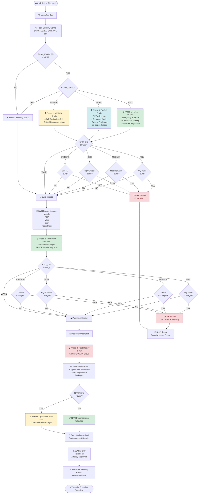
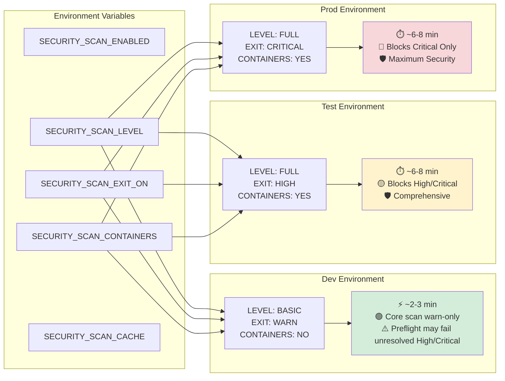
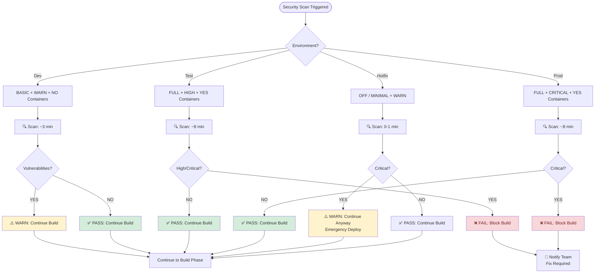
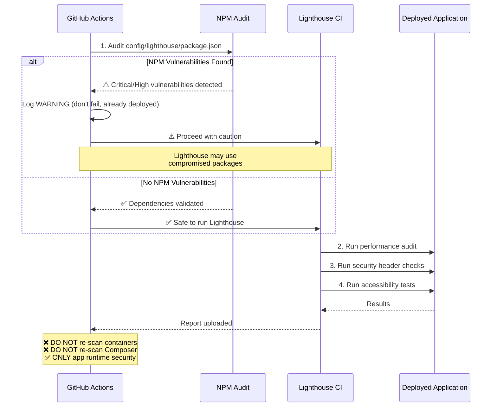
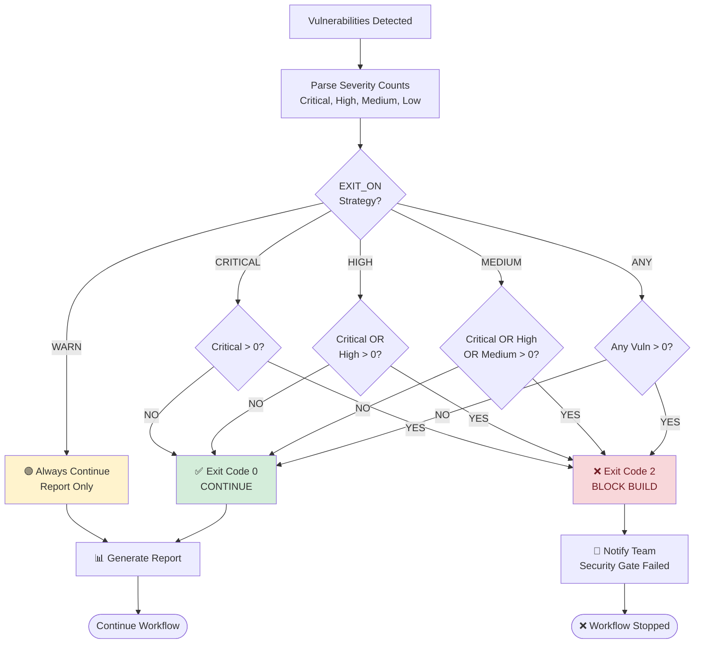

# 🔒 Security Scanning Flow Diagram

## Complete Security Scanning Architecture

---

## Configuration Impact Flow

---

## Security Scanning Decision Tree

---

## Phase 3: NPM-First Security Flow

**CRITICAL**: NPM audit BEFORE Lighthouse execution to prevent supply chain attacks

---

## Vulnerability Severity Exit Strategy

---

## Configuration Priority Matrix

| Priority | Configuration | Reason |
|----------|--------------|--------|
| 🔴 **CRITICAL** | `SECURITY_SCAN_ENABLED: "YES"` | Security scanning must be active |
| 🔴 **CRITICAL** | NPM audit BEFORE Lighthouse | Prevent supply chain attacks |
| 🟡 **HIGH** | `EXIT_ON` varies by environment | Balance security vs velocity |
| 🟡 **HIGH** | `SCAN_LEVEL: "FULL"` in prod | Comprehensive production validation |
| 🟢 **MEDIUM** | `SCAN_CONTAINERS: "NO"` in dev | Performance optimization |
| 🟢 **MEDIUM** | `SECURITY_SCAN_CACHE: "YES"` | Faster scans (30-60s savings) |
| 🔵 **LOW** | Scheduled deep scans | Weekly comprehensive audits |

---

## Summary

This flow diagram illustrates:

1. **Configuration-Driven**: Environment variables control all behavior
2. **Environment-Aware**: Different strategies for dev/test/prod
3. **Fail-Fast**: Critical issues caught in 2-3 minutes (Phase 1)
4. **Supply Chain Protection**: NPM audit BEFORE Lighthouse execution
5. **Non-Blocking Dev**: Warnings in dev, strict blocking in prod
6. **Performance Optimized**: Skip expensive scans in dev, enable in prod

**Key Insight**: Security scanning adapts to environment context while maintaining consistent protection.
