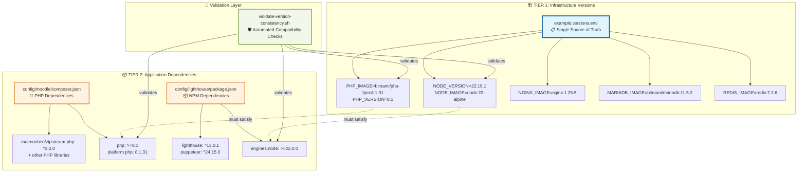
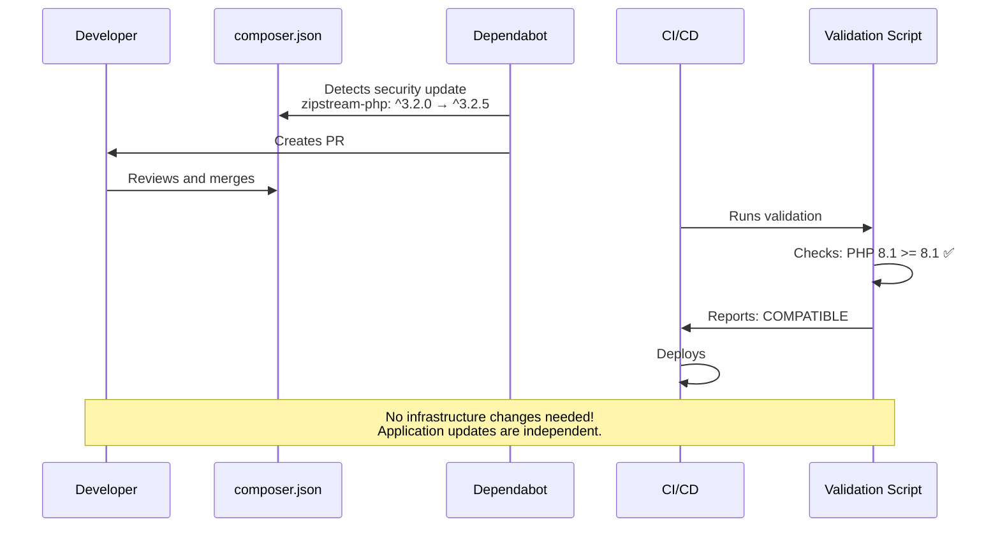
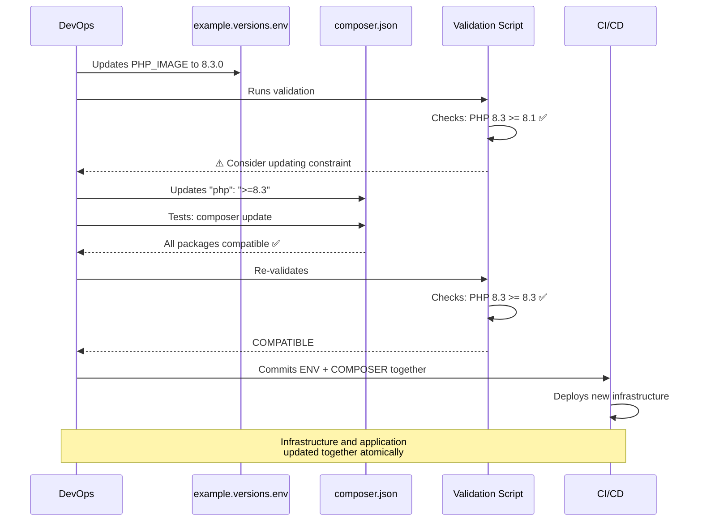
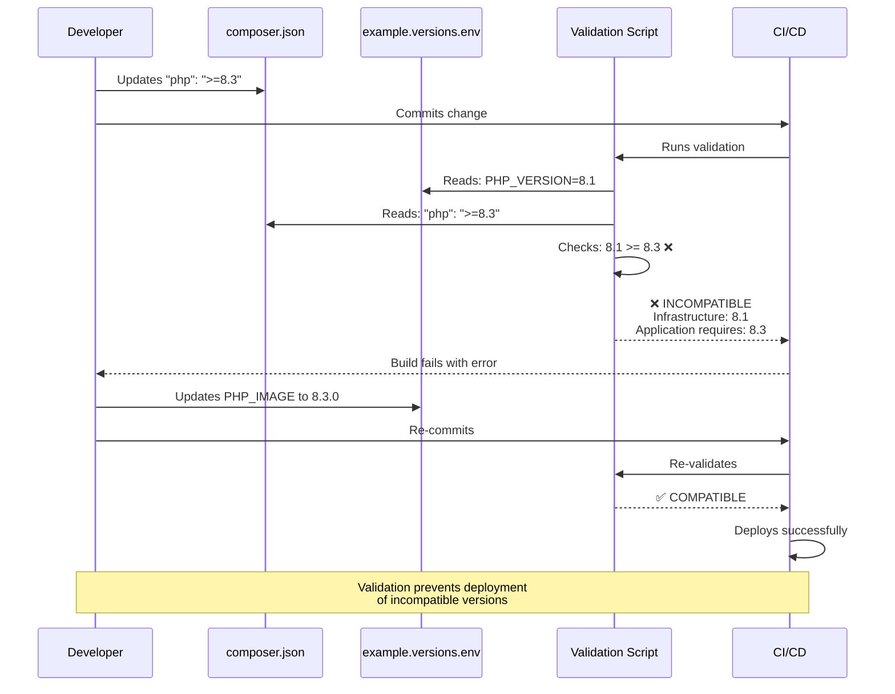
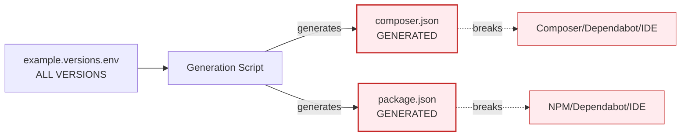
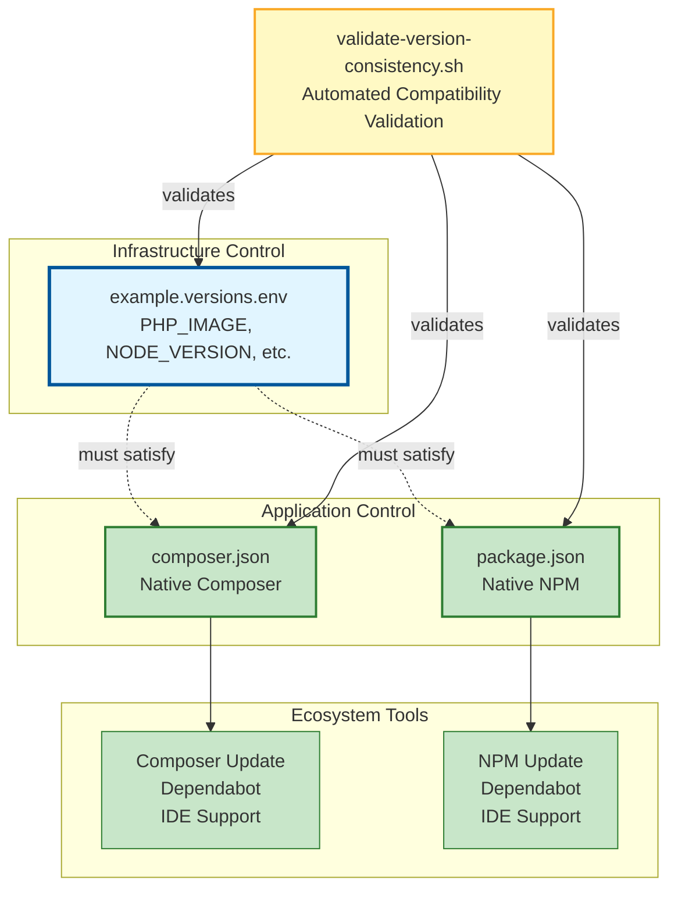
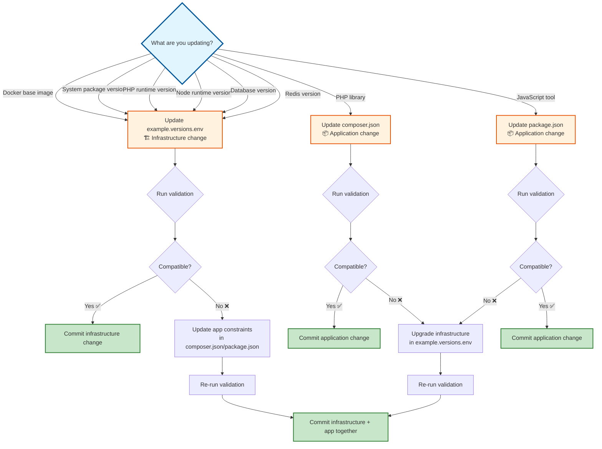
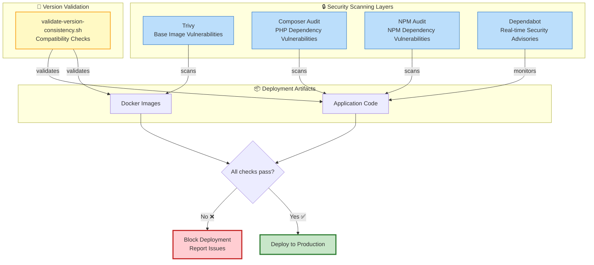

# Version Management Architecture

## 🏗️ Two-Tier System Overview

---

## 📊 Version Update Workflows

### Scenario A: Application Dependency Update

### Scenario B: Major Infrastructure Upgrade

### Scenario C: Version Mismatch Detection

---

## 🔄 Dependency Management Comparison

### ❌ Fully Centralized (Problematic)

**Problems:**

- 🚫 Breaks `composer update` and `npm update`
- 🚫 Dependabot can't understand env files
- 🚫 IDE/tooling integration fails
- 🚫 Can't use semantic versioning (`^`, `~`)
- 🚫 Team must learn custom system

### ✅ Two-Tier Architecture (Optimal)

**Benefits:**

- ✅ Standard tooling works natively
- ✅ Dependabot monitors both files
- ✅ Semantic versioning preserved
- ✅ Team uses familiar workflows
- ✅ Automated validation ensures compatibility

---

## 🎯 Decision Tree: Which File to Update?

---

## 🛡️ Security & Validation Flow

---

## 📋 Summary Table

| Aspect | Infrastructure (Tier 1) | Application (Tier 2) |
|--------|------------------------|----------------------|
| **File** | `example.versions.env` | `composer.json`, `package.json` |
| **Purpose** | Runtime environments | Installed libraries/tools |
| **Examples** | PHP 8.1, Node 22, Nginx 1.25 | zipstream-php, Lighthouse |
| **Update Frequency** | Quarterly / Major releases | Monthly / Security patches |
| **Versioning** | Exact versions (`8.1.31`) | Semantic ranges (`^3.2.0`) |
| **Managed By** | DevOps team | Development team |
| **Tools** | Docker, OpenShift | Composer, NPM, Dependabot |
| **Validation** | `validate-version-consistency.sh` | Native tool validation + compatibility check |
| **CI/CD Integration** | Image builds | Dependency installation |
| **Lock Files** | N/A (exact versions) | `composer.lock`, `package-lock.json` |

---

## 🎓 Key Principles

1. **Separation of Concerns**: Infrastructure stability vs application flexibility
2. **Tool-Native**: Use ecosystem tools for what they're designed for
3. **Automated Validation**: Catch incompatibilities early in CI/CD
4. **Atomic Updates**: Major upgrades commit infrastructure + application together
5. **Security Layers**: Multi-tool scanning at all dependency levels

---

*This architecture recognizes that **not all versions should be centralized.** Different types of dependencies have different lifecycles, tooling, and update patterns. The two-tier approach provides the right balance of control and flexibility.*
