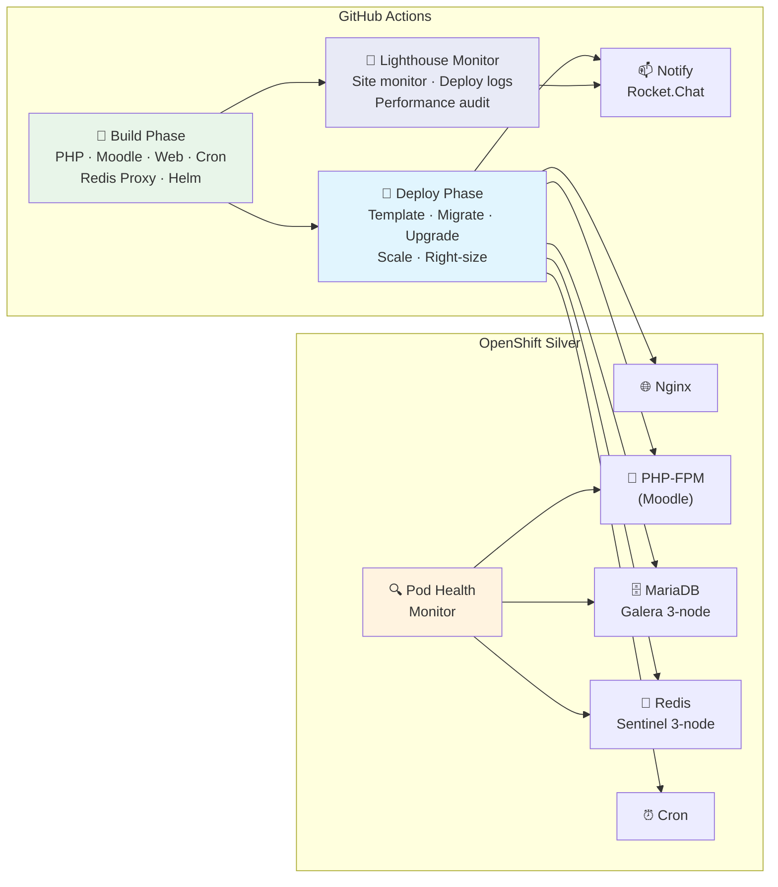

# 📊 Project Progress

High-level overview of CI/CD pipeline maturity, recent milestones, and active work.

---

## Pipeline Maturity

```mermaid
timeline
    title CI/CD Pipeline Evolution
    section Foundation
        Pod Health Monitoring       : Galera auto-heal, service health checks
        Monitoring Deployment       : Continuous pod-health-monitor
        Log Aggregation             : Inline + webhook forwarding
    section Build Optimization
        Lighthouse Front-loading    : NPM + APT deps cached in checkEnv
        Parallel Lighthouse Monitor : Runs alongside builds/deploy
        Maintenance-mode Failsafe  : Auto-enable on critical audit failure
    section Pipeline Hardening
        Utility Script Extraction   : site-monitor, deploy-logs, lighthouse-audit, maintenance-mode
        Trivy Cache Fix             : Eliminate DB collision between jobs
        Deploy Timeout Tuning       : 600s → 2400s for PVC-heavy deploys
        Pipeline Failure Detection  : GitHub API job status early-exit
    section CI Modernization
        Node.js 24 Action Upgrades  : 37 references across 10 workflows
        Lighthouse Output Streaming : Live per-page timing + scores in CI log
        Human-readable Timings      : Minutes/seconds in all monitor output
        Navigation + Score Fixes    : 120s timeout, Math.round scores
    section Operations & Modularity
        Split-Brain Resolution      : PT30S timeout, atomic my.cnf ConfigMap
        Right-Sizing Integration    : CSV + my.cnf unified workflow
        Universal Script Loader     : 16 bash scripts standardized
        Modular Refactoring Week 1  : coordination.sh, logging.sh, validation.sh extracted
        Modular Refactoring Week 2  : cluster-health, monitoring, secrets, pvc extracted
    section Recovery & Resilience
        Galera Recovery Automation  : 9-step PS1/bash recovery pipeline
        Probe Tuning                : Aligned Helm, Step 4.5, galera-values.yaml
        existingSecret Migration    : Eliminated plaintext passwords from Helm
        Unified OpenShift Auth      : ensure_openshift_auth for GH + in-cluster
        IST Failure Auto-Recovery   : Detect Disconnected pods, auto-delete for rejoin
```

---

## Recent Milestones

| Component | Summary |
|-----------|---------|
| **Galera Recovery Pipeline** | 9-step PS1/bash recovery (galera-recovery-step.ps1 + repair-mariadb-galera.sh) with -Force, -Status, -FromStep/-ToStep |
| **Probe Alignment** | Startup 5s/15s/80fail (~22min), readiness 5s/15s, liveness 10s/30s/6fail/180s-init — aligned across Helm, Step 4.5, galera-values.yaml |
| **existingSecret Migration** | Passwords read from K8s Secret instead of Helm --set values; deploy scripts create/ensure secret |
| **Unified OpenShift Auth** | `ensure_openshift_auth()` in coordination.sh works for both GH runners and in-cluster pods |
| **IST Failure Auto-Recovery** | `wait_for_galera_sync` detects Initialized/Disconnected pods, auto-deletes for clean SST rejoin |
| **Pod Health Check Fix** | `check_galera_pod_ready` checks Synced+Primary (not cluster_size), preventing false 0/N counts |
| **Modular Refactoring - Week 2** | Extracted cluster-health, monitoring, secrets, pvc modules (2,000 lines) |
| **Modular Refactoring - Week 1** | Extracted logging, validation, coordination modules (1,350 lines) |
| **Pod-Health Coordination** | MANUAL_MODE circuit breaker, namespace safety, cluster health API |
| **Split-Brain Resolution** | Atomic my.cnf ConfigMap updates with PT30S timeout |
| **Right-Sizing Automation** | Unified CSV + my.cnf workflow with auto-detection |
| **Universal Script Loader** | Standardized _utils.sh loader across 16 bash scripts |
| **Lighthouse Improvements** | stdout leak fix, streaming output, nav timeout, score precision |
| **Human-Readable Timings** | Minutes/seconds formatting across all monitoring tools |
| **Node.js 24 Migration** | Upgraded 37 action references across 10 workflows |
| **Pipeline Hardening** | Extracted utilities, Trivy cache fix, deploy timeout tuning |
| **Build Optimization** | Parallel lighthouse monitor, job log capture, dependency front-loading |

---

## Architecture at a Glance

---

## CI/CD Pipeline Components

| Component | Status | Notes |
|-----------|--------|-------|
| **Security scanning** | ✅ Active | Trivy + Composer audit + NPM audit; environment-tiered |
| **Lighthouse audit** | ✅ Active | 5 pages, per-page timing, live streaming, maintenance failsafe |
| **Site monitor** | ✅ Active | State machine with human-readable timings, pipeline failure early-exit |
| **Deploy log capture** | ✅ Active | migrate-build-files + moodle-upgrade job logs |
| **Node.js 24 actions** | ✅ Complete | 37 references upgraded; 3 third-party actions use env var fallback |
| **Pod health monitoring** | ✅ Active | Galera auto-heal, service health checks, webhook notifications |
| **Galera recovery automation** | ✅ Active | 9-step pipeline, IST auto-recovery, probe alignment |
| **Unified auth** | ✅ Active | ensure_openshift_auth for GH Actions + pod-health-monitor |
| **Docker layer caching** | ✅ Active | Artifactory registry, buildx cache |
| **Trivy DB caching** | ✅ Fixed | Branch-prefixed keys, continue-on-error for save collisions |
| **Modular script architecture** | ✅ Week 2 Complete | 7 modules extracted (3,350 lines); openshift.sh reduced to ~700 lines |
| **Pod-health coordination** | ✅ Active | MANUAL_MODE circuit breaker, namespace safety, cluster health API |
| **Cluster health monitoring** | ✅ Active | Infrastructure issue detection (PVC/CSI/node/network), automatic timeout extension |
| **Right-sizing automation** | ✅ Complete | CSV + my.cnf unified workflow, auto-detection |
| **Split-brain prevention** | ✅ Complete | PT30S my.cnf configs deployed and tested |

---

## Known Issues / Technical Debt

| Issue | Priority | Status |
|-------|----------|--------|
| `openshift.sh` modular refactoring (Week 3) | Low | Weeks 1-2 complete; resources, scaling, maintenance remain (~700 lines) |
| `WyriHaximus/github-action-helm3@v3` no node24 | Low | Cosmetic deprecation warning only |
| `muinmomin/webhook-action@v1.0.0` no node24 | Low | Cosmetic deprecation warning only |
| Lighthouse page load ~70s each | Low | Inherent to Lighthouse profiling; cold cache adds ~10-20s first page |
| Documentation updates | Low | In progress - Week 2 completion docs pending |

---

## Related Documentation

- **[Developer Tools](./../developer/README.md)** — PowerShell tools, in-cluster automation, split-brain resolution
- **[Split-Brain Resolution](./../developer/split-brain/README.md)** — Galera timeout configuration and testing
- **[Pod-Health-Monitor Coordination](./../pod-health-monitor-coordination-strategy.md)** — MANUAL_MODE, namespace safety, deployment lifecycle
- **[Modular Refactoring Plan](./../openshift-utilities-refactoring-plan.md)** — Week-by-week roadmap for openshift.sh split
- **[ConfigMap Path Strategy](./../configmap-path-resolution-strategy.md)** — Dual-path resolution for flattened ConfigMaps
- **[Build & Deployment Flow](./../diagrams/build-deployment-flow.md)** — Complete pipeline architecture with Mermaid diagrams
- **[Security Scanning](./../security-scanning.md)** — Configuration and environment-tier strategy
- **[Logging Levels](./../logging-levels.md)** — Three-tier logging system (INFO/DEBUG/TRACE)
- **[Galera Monitoring](./../galera-monitoring-solution.md)** — Pod health monitor architecture
- **[Centralized Dependencies](./../centralized-dependency-management.md)** — Two-tier version management
