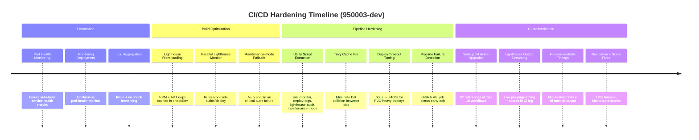
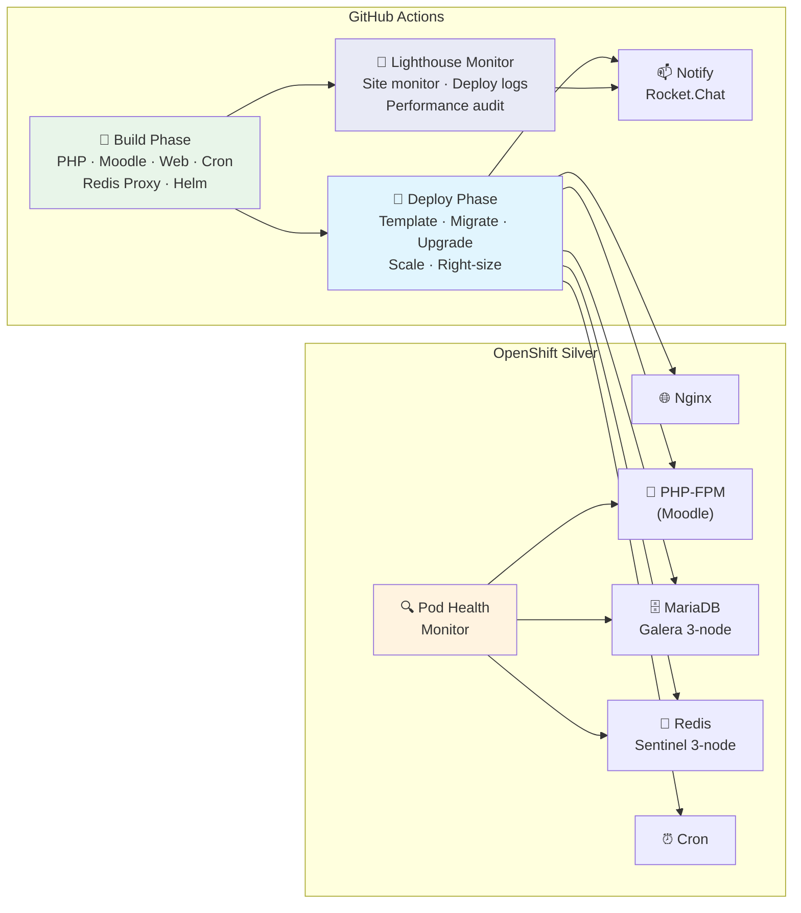

# 📊 Project Progress

High-level overview of CI/CD pipeline maturity, recent milestones, and active work.

---

## Pipeline Maturity

---

## Recent Commits (950003-dev)

| Commit | Summary |
|--------|---------|
| `b657b16` | fix(lighthouse): tee stdout leak, warn_count bug, nav timeout, score precision |
| `cd5871c` | fix(monitor): human-readable timings, fix HTTP 000000, stream Lighthouse output |
| `8f0919f` | chore(ci): upgrade GitHub Actions to Node.js 24 native versions |
| `c7327ec` | Merge branch — resolve divergence from amended commit |
| `4615719` | fix(build): extract monitoring utilities, fix Trivy cache and deploy timeouts |
| `bec6e64` | perf(build): parallel lighthouse monitor, job log capture, Node.js 24 opt-in |
| `91cd9f6` | fix(build): logging stubs for Lighthouse NPM security scan step |
| `777d164` | perf(build): front-load Lighthouse deps and security scan into checkEnv |
| `37e49b0` | fix(monitor): detailed per-pod issue reporting and post-restart verification |
| `28c448a` | fix(monitor): periodic status reporting, fix silent health checks |
| `012276b` | perf(build): optimize Lighthouse Audit job, add maintenance-mode failsafe |
| `1ff7adf` | refactor(monitor): remove dead files, consolidate health check functions |

---

## Architecture at a Glance

---

## CI/CD Pipeline Components

| Component | Status | Notes |
|-----------|--------|-------|
| **Security scanning** | ✅ Active | Trivy + Composer audit + NPM audit; environment-tiered |
| **Lighthouse audit** | ✅ Active | 5 pages, per-page timing, live streaming, maintenance failsafe |
| **Site monitor** | ✅ Active | State machine with human-readable timings, pipeline failure early-exit |
| **Deploy log capture** | ✅ Active | migrate-build-files + moodle-upgrade job logs |
| **Node.js 24 actions** | ✅ Complete | 37 references upgraded; 3 third-party actions use env var fallback |
| **Pod health monitoring** | ✅ Active | Galera auto-heal, service health checks, webhook notifications |
| **Docker layer caching** | ✅ Active | Artifactory registry, buildx cache |
| **Trivy DB caching** | ✅ Fixed | Branch-prefixed keys, continue-on-error for save collisions |

---

## Known Issues / Technical Debt

| Issue | Priority | Notes |
|-------|----------|-------|
| `falti/dotenv-action@v1` no node24 release | Medium | May silently fail under Node 24; env var fallback active |
| `WyriHaximus/github-action-helm3@v3` no node24 | Low | Cosmetic deprecation warning only |
| `muinmomin/webhook-action@v1.0.0` no node24 | Low | Cosmetic deprecation warning only |
| Lighthouse page load ~70s each | Low | Inherent to Lighthouse profiling; cold cache adds ~10-20s first page |
| Documentation gaps (README, scripts/utils) | Low | In progress |

---

## Related Documentation

- **[Build & Deployment Flow](./../diagrams/build-deployment-flow.md)** — Complete pipeline architecture with Mermaid diagrams
- **[Security Scanning](./../security-scanning.md)** — Configuration and environment-tier strategy
- **[Logging Levels](./../logging-levels.md)** — Three-tier logging system (INFO/DEBUG/TRACE)
- **[Galera Monitoring](./../galera-monitoring-solution.md)** — Pod health monitor architecture
- **[Centralized Dependencies](./../centralized-dependency-management.md)** — Two-tier version management
