# PVC Expansion Validation Guide

## Overview

This document outlines the validation process for automated PVC expansion in the MariaDB Galera StatefulSet. The expansion automation is triggered during Helm deployments when the CSV sizing file specifies a larger PVC size than currently exists.

## Related Documentation

- [PVC Management Functions](../openshift/scripts/utils/openshift.sh) - Lines 2724-3130
- [MariaDB Galera Deployment](../openshift/scripts/deploy-mariadb-galera.sh) - Lines 600-630
- [Right-Sizing Script](../openshift/scripts/right-sizing.sh)

## Test Configuration

### Environment Sizing Changes

| Environment | Namespace | Replicas | Current Size | Target Size | Expansion |
|-------------|-----------|----------|--------------|-------------|-----------|
| **Dev** | 950003-dev | 2 | 6 GiB | **7 GiB** | +1 GiB (test automation) |
| **Test** | 950003-test | 2 | 6 GiB | **7 GiB** | +1 GiB (test automation) |
| **Prod** | 950003-prod | 5 | 6 GiB | **10 GiB** | +4 GiB (production requirement) |

### Validation Strategy
1. ✅ Test in **dev** first (2 replicas, +1 GiB expansion)
2. ✅ Validate in **test** (2 replicas, +1 GiB expansion)
3. ⏸️ Apply to **prod** only after successful validation (5 replicas, +4 GiB expansion)

**Rationale**: 
- Dev/Test use modest +1 GiB to validate automation mechanics
- Prod configured for actual requirement (10 GiB) ready for deployment
- Larger expansion in prod (4 GiB) acceptable after dev/test validation proves reliability

## Pre-Deployment Validation

### 1. Check Current PVC State

```bash
# In dev namespace (950003-dev)
oc project 950003-dev

# List current MariaDB Galera PVCs
oc get pvc | grep mariadb-galera

# Expected output (before expansion):
# data-mariadb-galera-0   Bound   ...   6Gi    ...
# data-mariadb-galera-1   Bound   ...   6Gi    ...
```

### 2. Verify StorageClass Supports Expansion

```bash
# Get the StorageClass name
STORAGE_CLASS=$(oc get pvc data-mariadb-galera-0 -o jsonpath='{.spec.storageClassName}')

# Check if expansion is allowed
oc get storageclass "$STORAGE_CLASS" -o jsonpath='{.allowVolumeExpansion}'
# Expected: true
```

### 3. Check CSV Configuration

```bash
# Verify CSV has updated size
grep "mariadb-galera" openshift/950003-dev-sizing.csv

# Expected output (dev):
# mariadb-galera,sts,2,2,2,7168,60,0,256,0,0
#                             ^^^^ = 7 GiB in MiB

# Production target (for reference):
grep "mariadb-galera" openshift/950003-prod-sizing.csv
# mariadb-galera,sts,5,5,5,10240,100,0,256,0,0
#                             ^^^^^ = 10 GiB in MiB
```

## Deployment & Monitoring

### 1. Deploy with Monitoring

```bash
# Run deployment with expansion
./openshift/scripts/deploy-mariadb-galera.sh

# Watch the logs for PVC expansion messages:
# ━━━━━━━━━━━━━━━━━━━━━━━━━━━━━━━━━━━━━━━━━━━━━━━━━━━
# Monitoring PVCs during scale-up
# ━━━━━━━━━━━━━━━━━━━━━━━━━━━━━━━━━━━━━━━━━━━━━━━━━━━
#    Watching for PVCs: data-mariadb-galera-{0..2}
#    Will expand to: 7Gi
```

### 2. Monitor PVC Expansion in Real-Time

```bash
# In a separate terminal, watch PVC status
watch -n 2 'oc get pvc | grep mariadb-galera'

# Watch for:
# - spec.resources.requests.storage should update to 7Gi immediately
# - status.capacity.storage may take a few seconds to reflect 7Gi
```

### 3. Check for Expansion Events

```bash
# Check events for expansion activity
oc get events --sort-by='.lastTimestamp' | grep -i "volume\|expand\|resize"

# Look for events like:
# - "VolumeResizeSuccessful" - expansion completed
# - "FileSystemResizeSuccessful" - filesystem resize completed
```

## Post-Deployment Validation

### 1. Verify PVC Sizes

```bash
# Check all PVC specs and status
oc get pvc -l app.kubernetes.io/name=mariadb-galera -o custom-columns=\
NAME:.metadata.name,\
REQUESTED:.spec.resources.requests.storage,\
CAPACITY:.status.capacity.storage,\
STATUS:.status.phase

# Expected output:
# NAME                      REQUESTED   CAPACITY   STATUS
# data-mariadb-galera-0     7Gi         7Gi        Bound
# data-mariadb-galera-1     7Gi         7Gi        Bound
```

### 2. Verify Pod Filesystem

```bash
# Exec into each pod and check available space
for i in 0 1; do
  echo "=== Pod mariadb-galera-$i ==="
  oc exec mariadb-galera-$i -- df -h /bitnami/mariadb
done

# Expected output shows ~7GB filesystem
# /dev/xxx   7.0G   XXG   Available   XX%   /bitnami/mariadb
```

### 3. Validate Galera Cluster Health

```bash
# Check cluster sync status
./openshift/scripts/deploy-mariadb-galera.sh

# Verify:
# ✅ Galera cluster is consistent -- no split-brain detected
# ✅ All pods show wsrep_cluster_size = 2
# ✅ All pods show wsrep_local_state_comment = Synced
```

### 4. Test Database Operations

```bash
# Connect to primary pod
oc exec -it mariadb-galera-0 -- mysql -u root -p

# Run test queries
SHOW VARIABLES LIKE 'wsrep_cluster_size';  -- Should be 2
SHOW STATUS LIKE 'wsrep_local_state_comment';  -- Should be 'Synced'
SELECT COUNT(*) FROM moodle.mdl_user;  -- Verify data integrity

# Exit mysql
exit
```

## Troubleshooting

### PVC Expansion Hangs or Fails

**Symptom**: PVC shows `FileSystemResizePending` condition

```bash
# Check PVC conditions
oc describe pvc data-mariadb-galera-0 | grep -A 10 Conditions

# Common causes:
# 1. Pod must be running for online expansion
# 2. Filesystem type must support resize
# 3. StorageClass must allow expansion
```

**Resolution**:
```bash
# If pod is not running, scale up StatefulSet
oc scale sts mariadb-galera --replicas=2

# Watch for automatic filesystem resize when pod starts
oc get events --watch
```

### StorageClass Doesn't Support Expansion

**Symptom**: Script warns "Skipping PVC expansion (StorageClass limitation)"

```bash
# Check StorageClass
oc get storageclass netapp-file-standard -o yaml | grep allowVolumeExpansion

# If false or missing, contact platform team
# OpenShift 4.x netapp-file-standard usually supports expansion
```

### Split-Brain Detection After Expansion

**Symptom**: Different cluster UUIDs detected across pods

```bash
# Manual recovery
oc scale sts mariadb-galera --replicas=1  # Keep galera-0
oc delete pvc data-mariadb-galera-1       # Delete secondary PVC
oc scale sts mariadb-galera --replicas=2  # Rebuild secondary
```

## Success Criteria

### ✅ Dev Validation Checklist
- [ ] PVCs expanded from 6Gi → 7Gi
- [ ] Both pods running and synchronized
- [ ] Filesystem shows ~7GB available space
- [ ] No split-brain detected
- [ ] Database queries execute successfully
- [ ] No error events in namespace

### ✅ Test Validation Checklist
- [ ] PVCs expanded from 6Gi → 7Gi
- [ ] Both pods running and synchronized
- [ ] Filesystem shows ~7GB available space
- [ ] No split-brain detected
- [ ] Moodle site accessible and functional
- [ ] No error events in namespace

### ⏸️ Production Approval Criteria
**Only proceed to prod after:**
- [ ] ✅ Dev validation completed successfully
- [ ] ✅ Test validation completed successfully
- [ ] ✅ PVC expansion behavior is well-understood
- [ ] ✅ Team comfortable with production expansion (if needed)

## Rollback Procedure

**Note**: PVC shrinking is **not supported** in Kubernetes. Once expanded, PVCs cannot be reduced.

If issues occur:
1. **Data Integrity First**: Verify database integrity before any action
2. **Scale Issues**: Can scale StatefulSet down/up without affecting PVC size
3. **Recovery**: Use database backups if data corruption occurs

## CI/CD Impact

### Automated Deployment Flow

```mermaid
graph TD
    A[deploy-mariadb-galera.sh] --> B{CSV Size > Current Size?}
    B -->|Yes| C[expand_mariadb_galera_pvcs]
    B -->|No| D[Skip Expansion]
    C --> E[Wait for PVC Creation]
    E --> F[Patch PVC to Target Size]
    F --> G[Async Expansion]
    G --> H[Verify Galera Sync]
    D --> H
    H --> I[Split-Brain Check]
    I --> J[Deployment Complete]
```



### GitHub Actions Integration

The PVC expansion runs automatically during:
- Deploy workflow (`.github/workflows/deploy.yml`)
- Galera deployment step
- Right-sizing adjustments (`right-sizing.sh`)

## References

### Code Locations

| Component | File | Lines |
|-----------|------|-------|
| PVC Expansion Functions | [`openshift/scripts/utils/openshift.sh`](../openshift/scripts/utils/openshift.sh) | 2724-3130 |
| Galera Expansion Hook | [`openshift/scripts/deploy-mariadb-galera.sh`](../openshift/scripts/deploy-mariadb-galera.sh) | 600-630 |
| Size Configuration | [`openshift/950003-*-sizing.csv`](../openshift/) | - |

### Related Issues

- MariaDB Helm Chart doesn't auto-resize PVCs during upgrades
- Manual PVC expansion required pre-automation
- Production validation required before enabling

---

**Last Updated**: April 10, 2026  
**Validation Status**: Pending (dev/test deployment scheduled)
